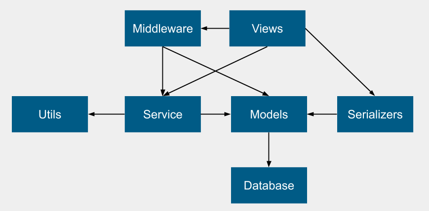

# Coding Patterns

In the attempt to keep a clean and consistent codebase, these are some coding
patterns that should be followed, except in special situations.

### Server
1. The server is a Django `project` that is made up of multiple Django `app`s.
Each `app` contains its own view/service/model layers. These apps are separated
by domain and should be natural boundaries for future microservice decomposition.
Therefore apps should ONLY access the `service` layer or above of other apps.  
For example, NOTHING in the `grips` app should import `users.models`.
1. Within each domain or Django `app`, the dependency directions between layers
should follow this picture. 

1. Within each domain or Django `app`, methods should generally have its own
domain object as its first argument.
Example include:
  - `is_admin(user_email, org_id)` in `users.service`, or
  - `has_voted_by(grip, user_email)` in `grips.service`.
1. `get_*` type methods in the model (data access) layer should return `None` if
such records do not exist, instead of propagating Django's `ObjectDoesNotExist`
exception.
1. Django serializers inheriting from `ModelSerializer` should always have
explicit list of fields in the `Meta` subclass. This prevents unintended
information leaks in api responses.

### Implicit assumptions
- The application assumes that one user can only belong to one organization.
But this invariance is not strongly enforced anywhere.
